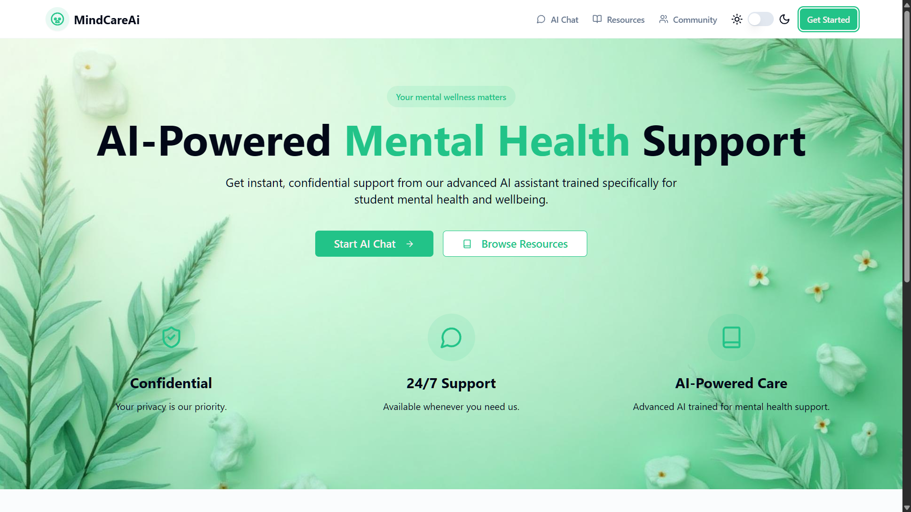

# MindCareAI

> An AI-powered platform designed to support the **mental health of college students**.  
MindCareAI provides a safe space where students can **interact with each other** and also get **personalized AI guidance** for their mental well-being.  

---

##  Features
-  **Peer Interaction** – Connect and chat with fellow college students.  
-  **AI Mental Health Assistant** – Ask AI for guidance, coping tips, and motivation.  
-  **Journaling & Reflections** – Maintain private notes to track emotions.  
-  **Privacy First** – Your conversations are secure and confidential.  
-  **Student-Centric** – Built specially for the challenges of college life.  

---

##  Landing Page Preview



---

##  Tech Stack
- **Frontend**: React / Next.js  
- **Backend**: Node.js / Express  
- **Database**: MongoDB / PostgreSQL  
- **AI Integration**: OpenAI / Gemini APIs  
- **Auth**: JWT / OAuth2  

---

##  Installation

```bash
# Clone the repository
git clone https://github.com/your-username/MindCareAI.git

# Navigate to the project
cd MindCareAI

# Install dependencies
npm install

# Start development server
npm run dev
